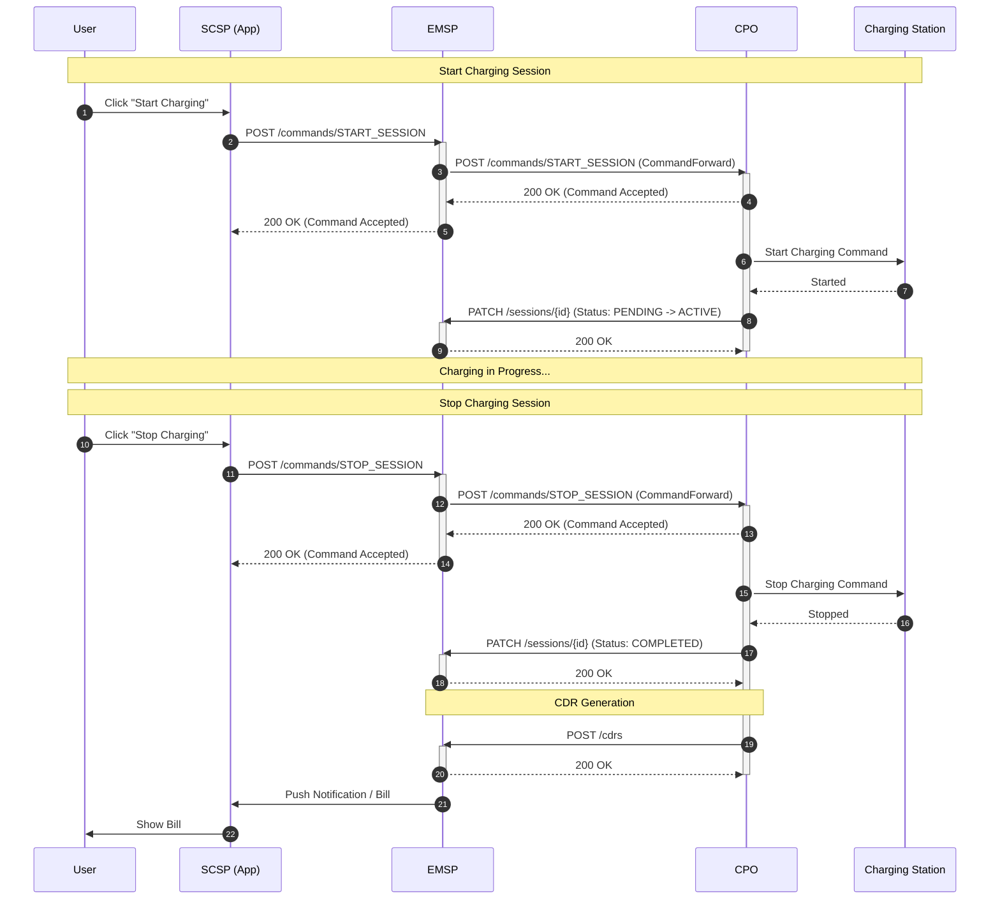

# OCPI Charging Flow Sequence Diagram

```mermaid
sequenceDiagram
    autonumber
    participant User
    participant SCSP as SCSP (App)
    participant EMSP
    participant CPO
    participant EVSE as Charging Station

    Note over User, EVSE: Start Charging Session

    User->>SCSP: Click "Start Charging"
    SCSP->>EMSP: POST /commands/START_SESSION
    activate EMSP
    EMSP->>CPO: POST /commands/START_SESSION (CommandForward)
    activate CPO
    CPO-->>EMSP: 200 OK (Command Accepted)
    EMSP-->>SCSP: 200 OK (Command Accepted)
    deactivate EMSP
    
    CPO->>EVSE: Start Charging Command
    EVSE-->>CPO: Started
    
    CPO->>EMSP: PATCH /sessions/{id} (Status: PENDING -> ACTIVE)
    activate EMSP
    EMSP-->>CPO: 200 OK
    deactivate EMSP
    deactivate CPO

    Note over User, EVSE: Charging in Progress...

    Note over User, EVSE: Stop Charging Session

    User->>SCSP: Click "Stop Charging"
    SCSP->>EMSP: POST /commands/STOP_SESSION
    activate EMSP
    EMSP->>CPO: POST /commands/STOP_SESSION (CommandForward)
    activate CPO
    CPO-->>EMSP: 200 OK (Command Accepted)
    EMSP-->>SCSP: 200 OK (Command Accepted)
    deactivate EMSP

    CPO->>EVSE: Stop Charging Command
    EVSE-->>CPO: Stopped

    CPO->>EMSP: PATCH /sessions/{id} (Status: COMPLETED)
    activate EMSP
    EMSP-->>CPO: 200 OK
    deactivate EMSP

    Note over CPO, EMSP: CDR Generation

    CPO->>EMSP: POST /cdrs
    activate EMSP
    EMSP-->>CPO: 200 OK
    deactivate EMSP
    deactivate CPO
    
    EMSP->>SCSP: Push Notification / Bill
    SCSP->>User: Show Bill
```
